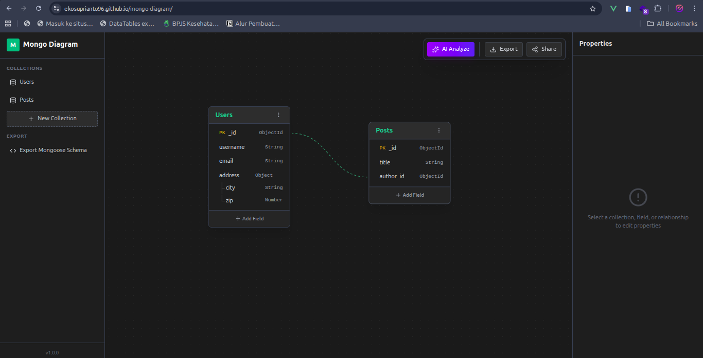

# Mongo Diagram

Mongo Diagram is a visual schema designer for **MongoDB, MySQL, and PostgreSQL** built with **Vue 3 + Vue Flow**.
You can model tables/collections, define fields, relationships, SQL constraints, then export code or full project JSON.

## Screenshot



## Current Version

- `v2.3.0`
- Version label in UI is loaded automatically from `package.json` via `VITE_APP_VERSION` sync.

## Main Features

- Multi-database workspace (MongoDB, MySQL, PostgreSQL) with database switch/create/delete.
- Dynamic naming by DB type:
  - MongoDB uses Collection terminology.
  - MySQL/PostgreSQL use Table terminology.
- Ordered default naming to avoid duplicates:
  - `new_collection_1`, `new_collection_2`, ...
  - `new_table_1`, `new_table_2`, ...
- Visual schema editor:
  - Add/delete nodes.
  - Add/delete/reorder fields.
  - Nested fields for MongoDB (`Object`, `Array`).
  - Multi-select + bulk export/delete.
- SQL field options and constraints:
  - `PRIMARY KEY`, `AUTO INCREMENT` / identity style support.
  - `UNIQUE`, `NULLABLE`, `INDEX`.
  - `FOREIGN KEY` + `ON DELETE` / `ON UPDATE`.
  - `CHECK` constraint expression.
- Export code:
  - MongoDB => Mongoose schema code.
  - MySQL/PostgreSQL => SQL DDL.
- SQL export is generated in runnable order:
  - `CREATE TABLE` first, then indexes, then foreign keys via `ALTER TABLE`.
- Export/import project JSON:
  - Strict payload validation on import.
  - Better error messages for invalid structure.
  - UI-only state (selection flags) is excluded from export payload.
- Undo/Redo history with env-configurable limits:
  - `VITE_HISTORY_MAX_SIZE`
  - `VITE_HISTORY_RETENTION_MS`
- Local storage persistence + storage quota warning.

## Release Notes

Full release notes are available in [`RELEASE_NOTES.md`](./RELEASE_NOTES.md).

## Environment Variables

- `VITE_HISTORY_MAX_SIZE=100`
- `VITE_HISTORY_RETENTION_MS=600000`
- `VITE_APP_VERSION=2.3.0`

## Version Sync Automation

This project includes automatic version sync from `package.json` to `.env`.

Available scripts:

- `npm run version:sync` -> sync `VITE_APP_VERSION` to `.env`
- `npm run dev` -> runs `predev` (auto sync) then starts Vite
- `npm run build` -> runs `prebuild` (auto sync) then builds app

## Test Import Data

Ready-to-import sample files are available in `test-data/`:

- `test-data/import-all-databases.json`
- `test-data/import-mongodb-only.json`
- `test-data/import-mysql-only.json`
- `test-data/import-postgresql-only.json`

## Tech Stack

- Vue 3
- Vite
- Pinia
- Vue Flow (`@vue-flow/core`, `@vue-flow/background`, `@vue-flow/controls`)
- Tailwind CSS 4
- Lucide Icons
- VueUse (`useStorage`)

## Project Structure

```txt
src/
  App.vue
  main.js
  style.css
  constants/
    dbTypes.js
  factories/
    databaseFactory.js
  stores/
    schemaStore.js
    uiStore.js
  utils/
    sqlGenerator.js
  components/
    Sidebar.vue
    DiagramCanvas.vue
    PropertiesPanel.vue
    CodeExport.vue
    ContextMenu.vue
    nodes/
      CollectionNode.vue
      FieldItem.vue
scripts/
  sync-version.mjs
test-data/
  import-all-databases.json
  import-mongodb-only.json
  import-mysql-only.json
  import-postgresql-only.json
```

## How to Run

### 1. Install dependencies

```bash
npm install
```

### 2. Start development server

```bash
npm run dev
```

### 3. Build for production

```bash
npm run build
```

### 4. Preview production build

```bash
npm run preview
```

## License

This project is licensed under the **MIT License**. See `LICENSE`.
